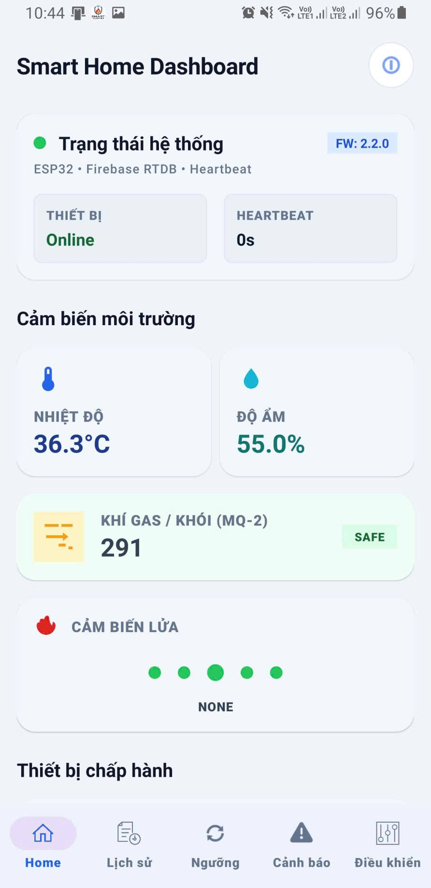
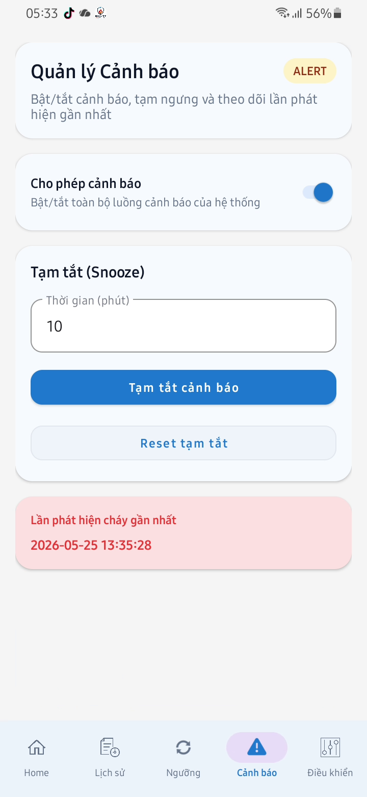
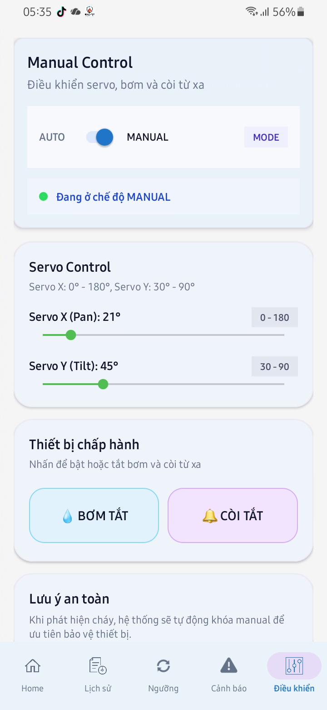
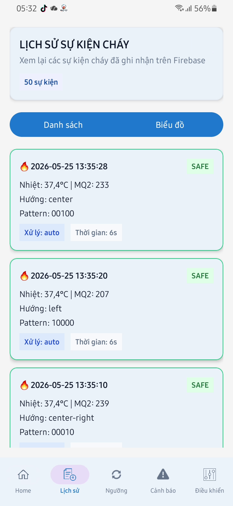
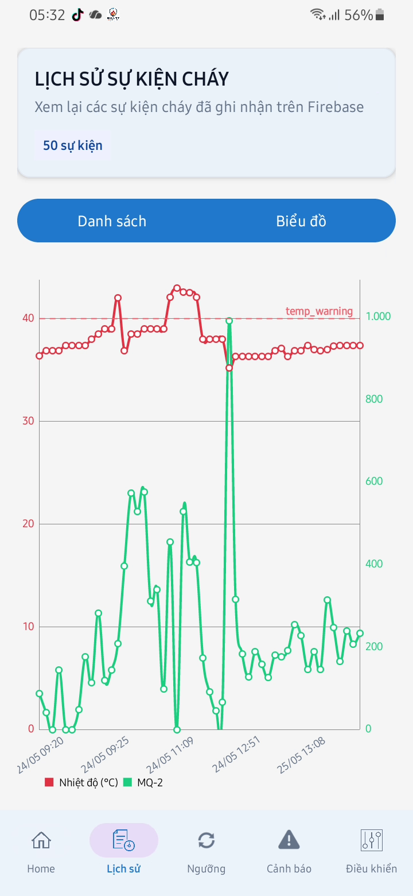
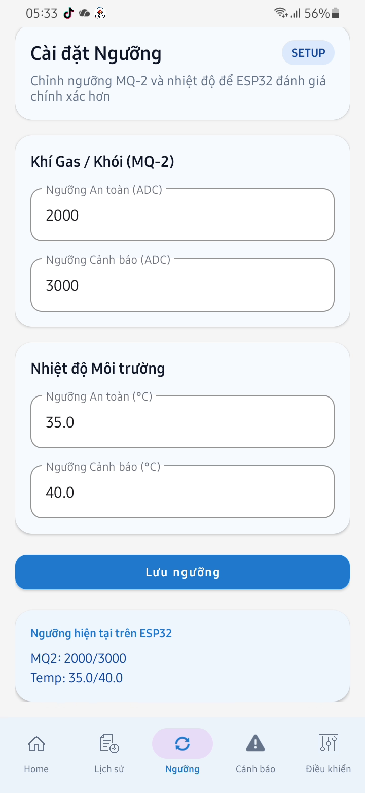
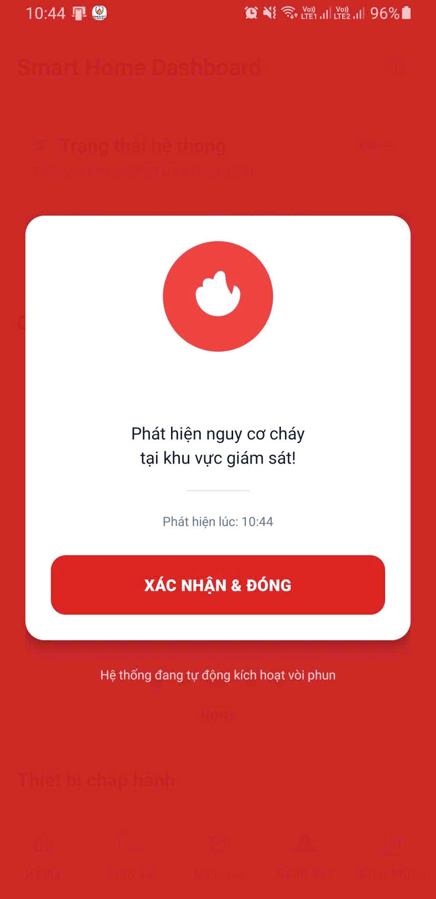
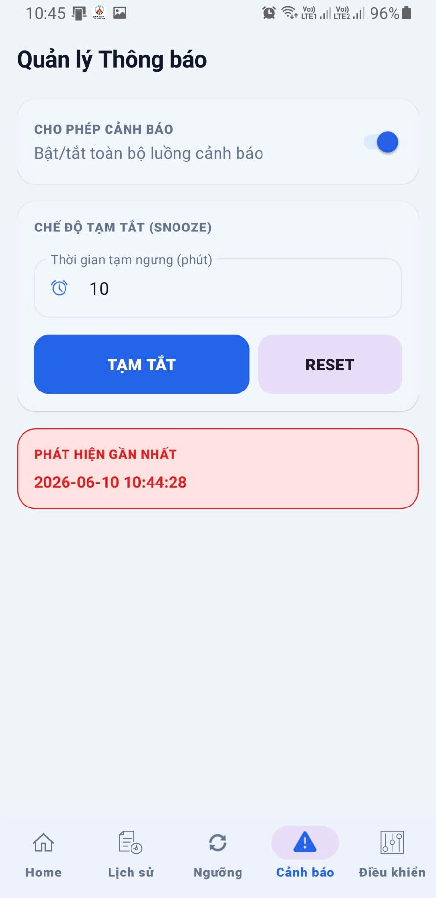

# IoT Automated Fire Extinguisher & Monitoring System

An IoT-based automated fire monitoring and directed extinguishing system. Features real-time environmental tracking and flame positioning using ESP32, multi-sensor fusion (Flame, MQ-2, DHT11), and a Pan-Tilt servo mechanism. Fully integrated with an Android application via Firebase for remote monitoring, manual override, and push notifications.

## 🚀 Features
- **Early Detection:** Uses a multi-sensor array (Temperature, Humidity, Smoke/Gas) for instant fire hazard identification.
- **Flame Positioning:** Employs a 5-way infrared sensor to locate the fire source's coordinates.
- **Directed Extinguishing:** Controls a Pan-Tilt mechanism (X and Y axes) to aim the water nozzle directly at the fire.
- **Real-time Monitoring:** Synchronizes environmental data and system status to an Android app via Firebase.
- **Manual Override:** Allows users to manually control the water pump and servo direction via a mobile joystick.
- **Smart Alerts:** Instant push notifications (FCM) and emergency dialogs when fire is detected.
- **Historical Data:** Visualizes fire events using lists and charts (MPAndroidChart).

## 🛠 Tech Stack
### Hardware
- **MCU:** ESP32 (Dual-core, Integrated Wi-Fi).
- **Sensors:** 
  - 5-Way Flame Sensor (Infrared).
  - MQ-2 (Gas & Smoke).
  - DHT11 (Temperature & Humidity).
- **Actuators:**
  - 2x MG90S Servos (Pan-Tilt mechanism).
  - 5V Mini Submersible Pump.
  - 5V Active-HIGH Relay.
  - Buzzer for local alarm.

### Software
- **Mobile App:** Android Java (Android Studio).
- **Backend:** Firebase Realtime Database (RTDB) & Firebase Cloud Messaging (FCM).
- **Firmware:** Arduino IDE / C++ for ESP32.
- **Protocol:** NTP for precise event timestamping.

## 📊 System Architecture
The system consists of 4 main functional blocks:
1. **Sensor Block:** Collects physical data (Temp, Smoke, Infrared).
2. **Central Controller (ESP32):** Processes logic, navigation algorithms, and communication.
3. **Warning Block:** Local buzzer and remote Android notifications.
4. **Actuator Block:** Pan-Tilt servos and water pump.

## 📈 Performance
- **Response Time:** Fire detection and pump activation in < 1.2s.
- **Control Latency:** ~0.5s manual override delay under stable Wi-Fi.
- **Reliability:** ESP32 operates independently even if the internet is lost to ensure safety.

## 📱 Android App UI

### Dashboard

<table>
  <tr>
    <td align="center"></td>
    <td align="center"></td>
    <td align="center"></td>
  </tr>
</table>

### History 

<table>
  <tr>
    <td align="center"></td>
    <td align="center"></td>
    <td align="center"></td>

  </tr>
</table>

### Alert

<table>
  <tr>
    <td align="center"></td>
        <td align="center"></td>
  </tr>
</table>


## System Flow

```text
[Cảm biến] -> [ESP32] -> [Firebase RTDB] -> [Android App]
      |            |              |
      |            |              +-> Dashboard / History / Alert / Control
      |            +-> Servo / Pump / Siren
      +-> DHT11 / MQ-2 / Flame Sensors
```

## Data Structure

```text
fire-alarm-system/
├── sensors/        (ESP32 writes -> App reads)
├── actuators/      (ESP32 writes -> App reads)
├── system/         (ESP32 writes -> App reads)
├── alert/          (App writes <-> ESP32 reads)
├── thresholds/     (App writes -> ESP32 reads)
├── control/        (App writes -> ESP32 reads via Stream)
└── logs/           (ESP32 writes -> App reads)
```

## Setup Instructions

## APK Download & Versioning (GitHub)

To make your GitHub page show versioned app downloads, use GitHub Releases.

1. Create a version tag and push it:

```bash
git tag v1.0.1
git push origin v1.0.1
```

2. The workflow in `.github/workflows/android-release.yml` will:
- Build the Android APK automatically.
- Create a GitHub Release named `SmartFireMonitoring vX.Y.Z`.
- Attach file `SmartFireMonitoring-vX.Y.Z.apk` for one-click download.

3. Users download from the `Releases` tab on GitHub.

Suggested version format:
- `v1.0.0` initial release
- `v1.0.1` bug fix
- `v1.1.0` new features

### Android App

1. Open the Android project in Android Studio.
2. Check that the file `google-services.json` is located in the `app/` directory.
3. Sync Gradle.
4. Build and run the app on an Android device or emulator.

### ESP32

1. Open the ESP32 firmware in Arduino IDE.
2. Update the following configurations: credentials.h
   - WiFi credentials (SSID and Password)
   - Firebase URL
   - Firebase Auth
3. Upload the firmware to the ESP32.

## Important Notes

- The system requires a stable internet connection for full functionality.
- Fire detection and alerts will be triggered when the system detects smoke or fire.
- Firebase and ESP32 configurations must be synchronized for the app to display data correctly.

